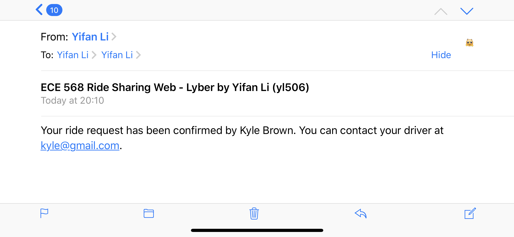

# HW1 - Ride Sharing Service Web App
## Yifan Li, yl506

### PREFACE:
Sorry for the late submission (due to some personal matters). I had met with Prof. Rogers and got a 1-week extension for this homework. Thanks for your understanding and your time to grade my homework.

To run the app: 
1. Clone the repo, `git clone https://gitlab.oit.duke.edu/yl506/erss-hwk1-yl506.git`
2. Open the project directory, `cd erss-hwk1-yl506`
3. Change permission for .sh files under `web-app` directory, `sudo chmod o+x *.sh`
4. Go back to the project directory (`erss-hwk1-yl506/`) and run docker `sudo docker-compose build && sudo docker-compose up`
5. Connect to the server and enjoy

### KEY FEATURES/FUNCTIONALITIES:

- Nice-looking frontend

- Navigation bar 

The navigation bar contains the links to make a ride request as a ride owner, search and claim a ride request as a driver, and search and join an open ride as a sharer. Links to registration and login pages are also included. "View Rides" page shows all the upcoming rides of the user as a rider.

- Registration / Login and Dashboard 

After a user successfully registered an account, he will be redirect to login page. After successful login, the dashboard page is presented. On this page, the user is able to register as a driver if he is not yet registered, or edit driver information if he has completed driver registration. And all the rides the user is involved in, including past trips, are listed. The user can check the details of a selected ride by clicking "View Details" button for each ride. Logged-in users can always logout by clicking the logout tab.

- Driver registration and update 

Required fields for driver registration include the vehicle type (text), license plate number (text), maximum capacity (int) and specialty (text). The 'specialty' field is added as an additional input that a ride owner can specify when requesting a ride. If a ride owner does specify vehicle type or specialty, the specified fields must match driver's corresponding fields for a driver to claim the ride request.

- Ride owner 

A logged-in user can click the request button on the navigation bar to make a ride request. Required input fields include the destination (street name, city, and state), number of passengers in owner's party, estimated arrival time, and the option to make the ride shareable. Optional input fields include vehicle type and specialty request. After successfully requesting a ride, the owner could edit the ride requests or cancel requests from dashboard or from "View Rides" tab on the navbar. 

NOTE: once a sharer joins the ride or the ride is confirmed by a driver, the owner is no longer able to edit or cancel the ride. See danger log 2/5 for further discussions.

- Ride sharer 

A logged-in user can click the join button on the navigation bar to search for open rides and join a ride. Required input fields include the destination (street name, city, and state), number of passengers in sharer's party, and estimated arrival time. Specifically, the street name entered by the sharer must match the owner's to join the ride. Date must also match, but there is no limitations on exact time (hour and minute) for a sharer to join an open ride. Once the form is submitted, the search results are displayed and the sharer can choose to view ride details or join this ride. After successfully joining a ride, the sharer could edit the ride requests or cancel requests from dashboard or from "View Rides" tab on the navbar.

- Ride driver 

A logged-in user can click the claim button on the navigation bar to search for open rides and confirm a ride, if the logged-in user has already completed driver registration. Search results are filtered such that the maximum capacity is enough for the owner's party and the sharer's party. Also, the vehicle type and specialty requested by the owner must match the driver's. Then the driver can choose to view the details of the ride request or confirm the ride. Then, a confirmation email will be sent. The driver will then be redirected to dashboard and all rides are listed. The driver can mark a ride as complete in dashboard page.

NOTE: The functions of sending emails were implemented succesfully but commented out for now, since Gmail does not allow my VCM to access my mail that requires my password. I attached some screenshots showing the received email sent successfully by the server when running on my own machine. Please fill out related fields at the end of `ride_sharing_web_app_project/settings.py` and within the `driver_confirm_ride(request)` function inside `rides/views.py` to test the actual email sending functionality.

