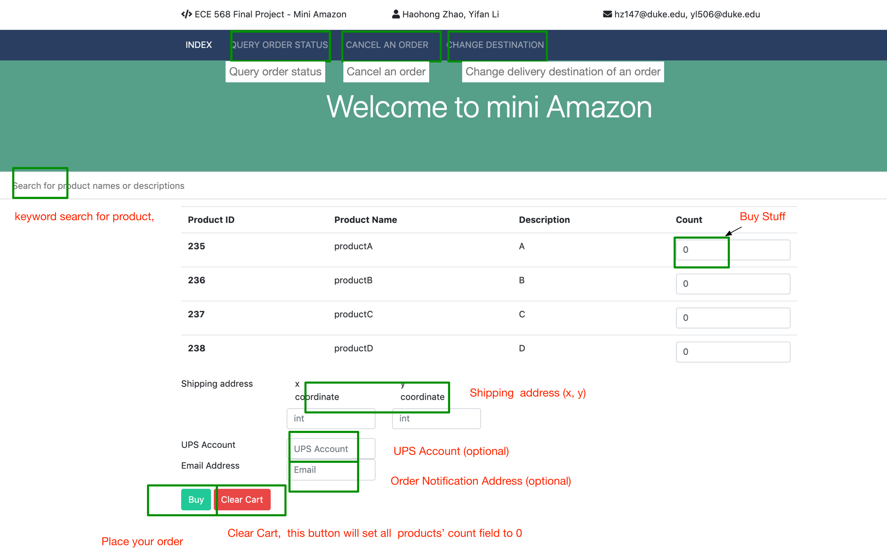

## ECE568 Final Project - Mini Amazon

### Authors: Yifan Li (yl506), Haohong Zhao (hz147) 

ECE568 final project, working with Mini UPS and world simulator. Mini Amazon contains a webapp(frontend) and a amazon_server(backend.)

#### Usage

1. In `amazon_server/server.py, line 22~23`, setup `WORLD_ADDRESS` and `UPS_ADDRESS`. 
2. Make sure that Mini UPS and world is running.
3. Go to root directory and run `docker-compose build && docker-compose up` in root folder.
4. If you run locally, open url `127.0.0.1:8000` in a browser. if you run on a server, open `<yourhost>:8000` .

#### Note

1. If you would like to add more warehouses or products, go to `web-app/amazon_website/amazon_frontend/db_initialization.py` and change sql respectively.

   

#### Website introduction

 